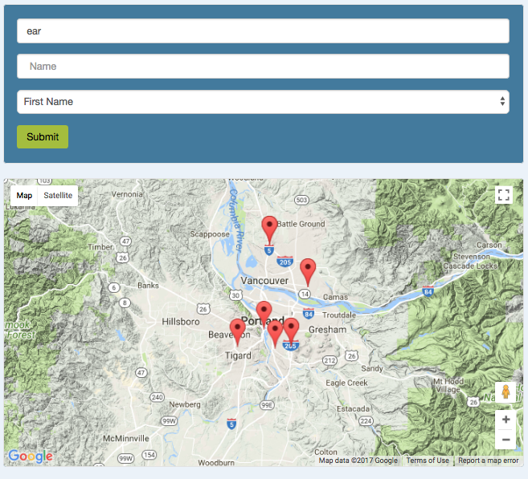
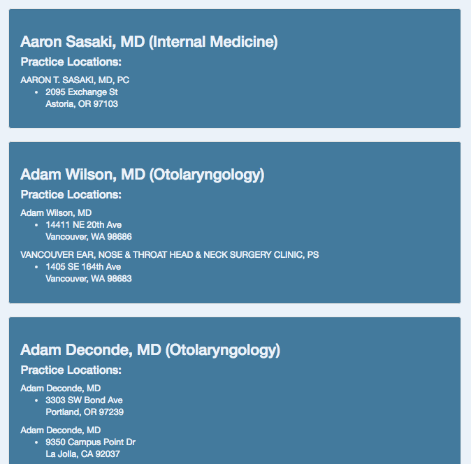

# Doctor Finder # 
#### _by Max Scher_
### Utilize BetterDoctor API to create a find-a-doctor web application

## Description
The Doctor Finder empowers users to find doctors that specialize in or treat a given ailment or issue simply by submitting said issue. A live version of this web app has been [deployed here](https://doctor-finder-5dc0f.firebaseapp.com/) via firebase.

View Screenshots

 
  
  

## Required Programs
1. Node.js [(Installation instructions)](https://www.learnhowtoprogram.com/javascript/getting-started-with-javascript-2f9a73dc-b7f5-4a22-9101-e69d49f552ac/installing-node-js)  
2. Sass  
  a. In command line...  `$ npm install sass -g`

## Setup
_Download the Application_
1. Open GitHub repository in your browser: https://github.com/maxobaxo/doctor-finder
2. Select the green dropdown menu to clone this repository.
3. Copy the link for the GitHub repository.
4. Open Terminal on your computer.
5. In Terminal, perform the following steps:
    * type `cd desktop` and press enter
    * type `git clone` then paste the repository link, and press enter

_Acquire and Implement Your API key_

6. Visit the [BetterDoctor API](https://developer.betterdoctor.com/) and click Get a free API key.  
7. Sign up, filling out the form, and submit your information.
8. Your API key should be listed on the front page (ex: “a2c356ibgh44…..”) or under My Account > Applications.
9. In Terminal,
  * type `cd doctor-finder` to access the path on your computer
  * type `npm install` and `bower install` to download the project's dependencies.
10. Create a .env file at the top level of the doctor-finder folder, in which you need to write: exports.apiKey = "YOUR-API-KEY-HERE";
11. Save the file.

_Open the Program_
12. In Terminal, while in the doctor-finder folder, open index.html

## Specifications
* It can return a list of doctors when the user inputs a medical issue.
  * Example Input: "Rash"
  * Example Output: "Susan Koch, Sean Rash"

## Known Bugs
* If the user submits an empty form, only 5 results show up, instead of the entire list of Portland-area providers.
* There is a slight delay in the map load-time upon form submission.

## Technologies Used
HTML, CSS, JavaScript, Git, Node.js, Gulp, Bower, Bootstrap, jQuery

## License Information
This applications utilizes the MIT License.  
Max Scher &copy; 2017
